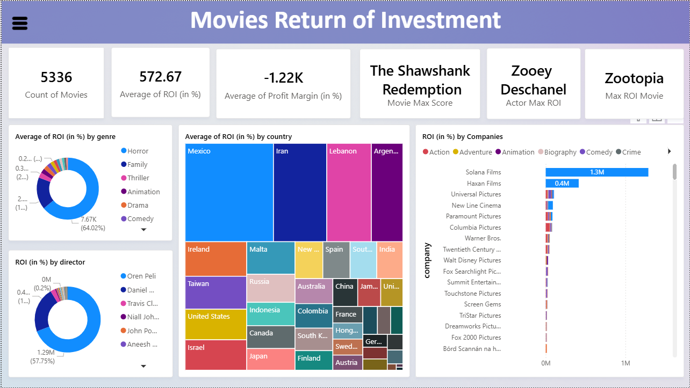
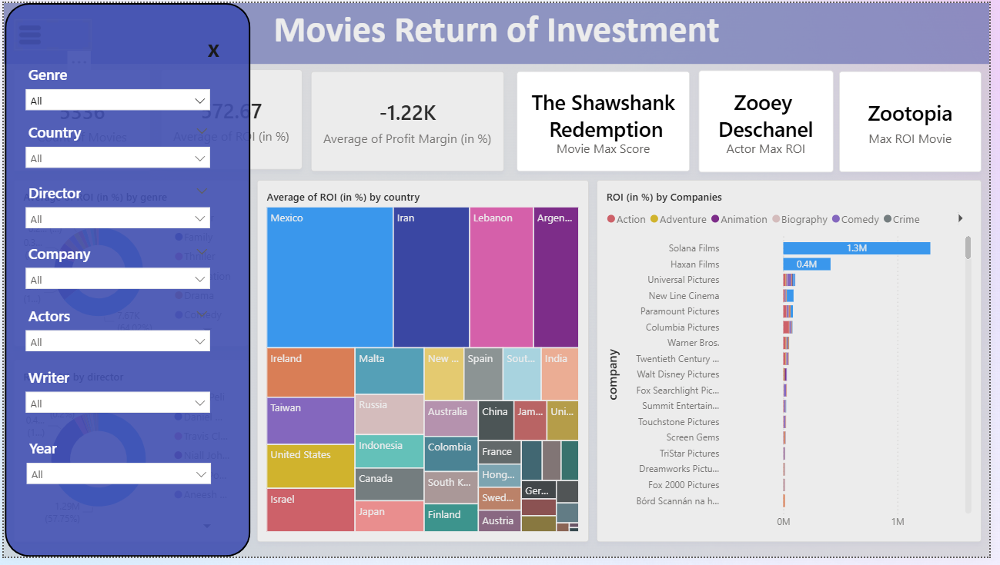
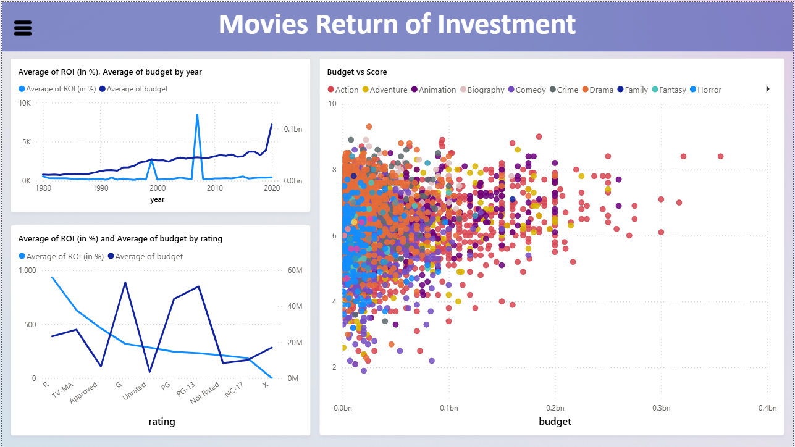

#  Movies ROI (Return on Investment) Dashboard

##  Project Overview

This **Power BI dashboard** analyzes the financial performance of **5,000+ movies** to uncover key patterns in **profitability, budget allocation, and return on investment (ROI)**.  
The dataset includes attributes such as *genre, production company, budget, ROI, profit margin, country, rating,* and *release year.*

### **Snippets from the dashboard:**

The dashboard helps to identify:

- Which genres, countries, and companies consistently achieve higher ROI.  
- How movie budgets and ratings influence profitability.  
- The relationship between spending patterns and critical success (ratings).

---

##  Tools & Technologies

- **Power BI** – Dashboard design and interactive visualizations  
- **Python (Pandas, NumPy)** – Data preprocessing and cleaning

---

##  Dashboard Components

###  KPI Cards (Top Overview)

| Metric | Value |
|--------|--------|
| Total Movies | 5,336 |
| Average ROI | 572.67 % |
| Average Profit Margin | -1.22 K % |
| Highest Rated Movie | *The Shawshank Redemption* |
| Top ROI Actor | *Zooey Deschanel* |
| Top ROI Movie | *Zootopia* |

 **Insight:**  
Despite a high average ROI, the negative profit margin suggests many movies fail to recover their budgets due to uneven spending and distribution inefficiencies. 

---

###  ROI by Genre

A **donut chart** compares average ROI across genres.

- **Horror**, **Family**, and **Thriller** genres dominate ROI, with Horror contributing ~64% of total returns.  
- **Action** and **Comedy** deliver stable but moderate ROI.

 **Insight:**  
Low-budget genres like Horror and Family films provide exceptional profitability per dollar spent, making them ideal for investors with limited capital.

---

###  ROI by Director

- Directors like **Oren Peli** (known for low-budget hits, i.e., the Paranormal Activity franchise) achieve ROI > **1.2M %**, proving small-budget, high-concept films can outperform blockbusters.  
- ROI distribution is heavily concentrated among a few directors, showing that **creative direction and cost control** drive profitability.

---

### ROI by Country

A **treemap visualization** highlights the most profitable production regions.

- **Mexico**, **Iran** and **Lebanon** lead with exceptionally high ROI.  
- **U.S., India, and U.K.** have large production volumes but moderate ROI.

 **Insight:**  
Emerging markets with lower production costs and strong local audiences yield the highest ROI — an opportunity for studios to expand into **international co-productions**.

---

###  ROI by Company

A **horizontal bar chart** compares ROI among production companies.

- **Solana Films** and **Haxan Films** show massive ROI (~1.3M %), outperforming major studios.  
- Big players like **Warner Bros., Disney,** and **Paramount** show steady but lower ROI, reflecting higher cost structures.

 **Impact:**  
Independent studios, when executing targeted projects, can outperform traditional powerhouses — showing that **agility and creative risk-taking** maximize returns.

---

###  ROI and Budget by Year

A **dual-axis line chart** tracks ROI % and average budget over time.

- Budgets have steadily increased post-2000, but ROI fluctuates.  
- Notable spikes for ROI around **2009–2010** .  
- Recent years show rising budgets but declining ROI, which explains the high negative average Profit Margin.

 **Recommendation:**  
Focus on **efficient budgeting**, **data-driven marketing** and also on good story for the movie, not just large budgets, to sustain profitability.

---

### ROI and Budget by Rating

This visualization compares **audience ratings vs. profitability**.

- Movies rated **R and TV-MA** yield strong ROI, despite low budget.
- **X-rated** films tend to underperform with the lowest average ROI.
- **G, PG and PG-13** also have low ROI but have some of the highest budget.
- **Unrated** and niche films show volatility.

 **Insight:**  
Content for mature audiences maintains consistent profitability and brand longevity. Ratings strongly influence **audience size** and **ad revenue potential**.

---

###  Budget vs. Score Scatterplot

A **scatter plot** visualizes **Budget vs. IMDb/Review Score by genre**.

- Higher-budget films do **not necessarily** achieve higher scores.  
- **Drama** and **Biography** genres cluster around high scores but moderate budgets.  
- **Action** and **Adventure** films have large budgets but highly variable scores.
- **Horror** movies have low budget and high scores.

**Key Takeaway:**  
Critical acclaim doesn’t depend solely on budget — **story quality and direction** drive audience engagement.

---

## Business Impact Summary

| Aspect | Insight | Business Action |
|--------|----------|-----------------|
| Genre Profitability | Horror & Family dominate ROI | Invest in low-budget, high-concept scripts |
| Budget Efficiency | High budgets ≠ high ROI | Focus on lean production pipelines |
| Market Expansion | Emerging markets show high ROI | Co-produce with international studios |
| Ratings Impact | Mature ratings outperform Family content | Prioritize R rated content |
| Talent Impact | Specific directors drive massive ROI | Partner with proven, cost-efficient directors |

---

##  Overall Conclusion

The analysis demonstrates that **strategic budgeting, targeted genre selection, and international diversification** are key to improving ROI in the movie industry.  

Major studios can use these insights to balance artistic ambition with financial performance, while **smaller studios** can capitalize on niche markets for **exponential returns**.
